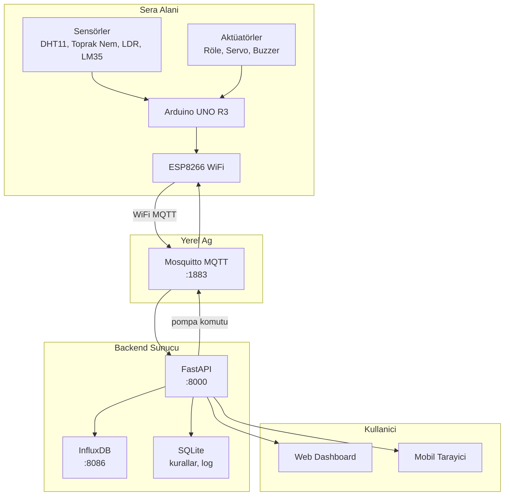

# Sistem Mimarisi

> Donanım referansı: [malzemeler.md](malzemeler.md)

## Genel Mimari



---

## Veri Akışı

### Sensör → Dashboard (Publish)

```
1. Arduino sensörleri okur (30 sn aralık)
2. JSON paketi oluşturur
3. ESP8266 üzerinden MQTT publish
4. FastAPI mqtt_client.py mesajı alır
5. InfluxDB'ye zaman serisi yazar
6. WebSocket ile dashboard'a iletir
```

### Dashboard → Pompa (Subscribe)

```
1. Kullanıcı dashboard'da "Pompa Aç" tıklar
2. POST /api/actuators/pump
3. FastAPI MQTT publish: sera/{id}/actuator/pump
4. ESP8266/Arduino komutu alır
5. Röle tetiklenir, pompa çalışır
```

---

## MQTT Topics {#mqtt-topics}

Tüm topic'ler `sera/{device_id}/` prefix'i ile başlar. Varsayılan `device_id`: `greenhouse-01`

### Sensör (Publish — Arduino → Broker)

| Topic | Payload örneği | Açıklama |
|-------|----------------|----------|
| `sera/greenhouse-01/sensor/temperature` | `{"value": 24.5, "unit": "C"}` | Ortam sıcaklığı |
| `sera/greenhouse-01/sensor/humidity` | `{"value": 65, "unit": "%"}` | Ortam nemi |
| `sera/greenhouse-01/sensor/soil_moisture` | `{"value": 42, "unit": "%"}` | Toprak nemi |
| `sera/greenhouse-01/sensor/light` | `{"value": 780, "unit": "raw"}` | LDR ham değer |
| `sera/greenhouse-01/sensor/water_level` | `{"value": 85, "unit": "%"}` | Su seviyesi |
| `sera/greenhouse-01/status` | `{"online": true, "uptime": 3600}` | Cihaz durumu |

### Aktüatör (Subscribe — Broker → Arduino)

| Topic | Payload örneği | Açıklama |
|-------|----------------|----------|
| `sera/greenhouse-01/actuator/pump` | `{"state": "on", "duration": 5}` | Pompa kontrolü |
| `sera/greenhouse-01/actuator/servo` | `{"angle": 90}` | Servo açısı |

---

## REST API

Base URL: `http://localhost:8000`

| Method | Endpoint | Açıklama |
|--------|----------|----------|
| GET | `/api/sensors/latest` | Son sensör değerleri |
| GET | `/api/sensors/history?sensor=humidity&hours=24` | Geçmiş veri |
| POST | `/api/actuators/pump` | Pompa aç/kapa |
| POST | `/api/actuators/servo` | Servo açı ayarla |
| GET | `/api/rules` | Sulama kuralları |
| PUT | `/api/rules` | Kuralları güncelle |
| GET | `/api/alarms` | Alarm geçmişi |
| WS | `/ws/live` | Canlı veri akışı |

---

## Veritabanı

### InfluxDB (zaman serisi)

- **Org:** sera
- **Bucket:** greenhouse
- **Measurement:** sensor
- **Tags:** device_id, sensor_type
- **Fields:** value

### SQLite (metadata)

- `rules` — sulama kuralları (eşik değerleri)
- `alarms` — alarm geçmişi
- `devices` — kayıtlı cihazlar

---

## Sulama Kural Motoru

Varsayılan kurallar (`backend/models/rules.py`):

| Kural | Koşul | Aksiyon |
|-------|-------|---------|
| Düşük nem | toprak_nem < 30% | Pompa 5 sn aç |
| Yüksek sıcaklık | sıcaklık > 35°C | Buzzer alarm |
| Zamanlanmış | 06:00-08:00 arası | Günlük sulama kontrolü |
| Su bitti | water_level < 10% | Buzzer + dashboard alarm |

---

## Güvenlik (Başlangıç → İlerleme)

| Aşama | MQTT | API |
|-------|------|-----|
| Geliştirme | Anonymous, yerel ağ | CORS açık |
| Prototip | Kullanıcı/şifre | API key |
| Üretim | TLS (8883) | JWT auth |

---

## Donanım Katmanları

```
Katman 1: Sensörler (DHT11, toprak nem, LDR, LM35, su seviye)
    ↓ analog/dijital
Katman 2: Arduino UNO (okuma, karar, kontrol)
    ↓ SoftwareSerial
Katman 3: ESP8266 (WiFi, MQTT)
    ↓ 802.11 WiFi
Katman 4: MQTT Broker (Mosquitto)
    ↓
Katman 5: FastAPI Backend
    ↓ REST + WebSocket
Katman 6: Web Dashboard
```

---

## Dosya Eşlemesi

| Bileşen | Dosya |
|---------|-------|
| Ana firmware | `firmware/arduino/greenhouse/greenhouse-controller.ino` |
| MQTT istemci (backend) | `backend/mqtt_client.py` |
| REST API | `backend/main.py` |
| Kural motoru | `backend/models/rules.py` |
| Dashboard UI | `frontend/index.html` |
| Canlı grafikler | `frontend/js/dashboard.js` |
| Docker servisleri | `docker-compose.yml` |
